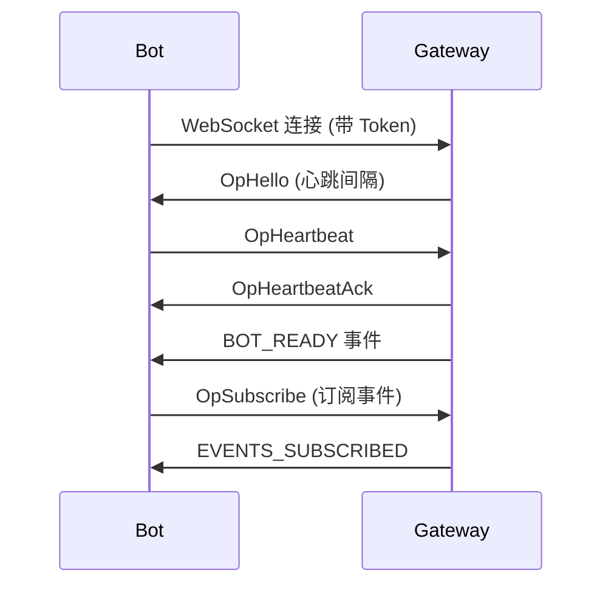
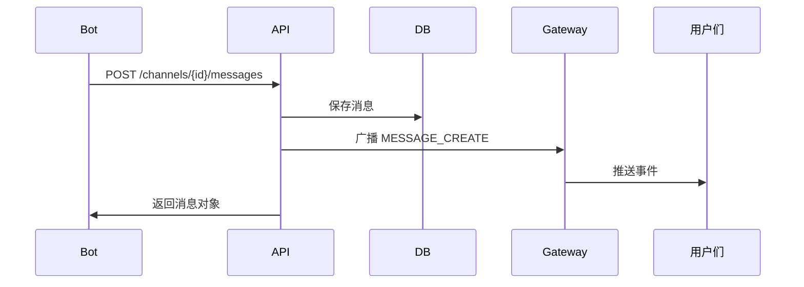

# 架构说明

本文档说明 Bubble 机器人的架构设计、工作原理和最佳实践。

## 整体架构

```
┌─────────────────┐
│   您的机器人     │
│  (Bot Client)   │
└────────┬────────┘
         │
         │ ① WebSocket Gateway（实时）
         │ ② Webhook（HTTP 回调）
         │ ③ HTTP API（主动请求）
         │
         ▼
┌─────────────────────┐
│  Bubble API Server  │
├─────────────────────┤
│  - 认证鉴权          │
│  - 事件分发          │
│  - 消息处理          │
│  - 权限管理          │
└──────────┬──────────┘
           │
           ▼
  ┌────────────────┐
  │  数据库 + Redis │
  └────────────────┘
```

## 机器人生命周期

### 1. 创建与配置

1. 开发者在平台创建机器人
2. 系统生成 Bot Token 和 Bot User
3. 机器人被邀请到服务器

### 2. 连接与认证



### 3. 事件接收

机器人连接后：

1. **自动订阅资源**：系统自动订阅机器人加入的所有服务器频道和私聊
2. **手动订阅事件**：机器人需要主动订阅感兴趣的事件类型
3. **接收事件**：只接收已订阅事件类型的消息

### 4. 消息发送



## 核心组件

### Bot User

每个机器人都有一个关联的用户账号（Bot User）：

- 拥有独立的用户 ID
- 可以加入服务器和频道
- 可以发送和接收消息
- 特殊标识：`isBot: true`

### Token 认证

Bot Token 是 JWT 格式的访问凭证：

- 包含机器人 ID 和权限信息
- 用于所有 API 请求的认证
- 支持刷新和重置

### 事件订阅

两层订阅机制：

1. **资源订阅**（自动）：频道、私聊线程
2. **事件类型订阅**（手动）：MESSAGE_CREATE、GUILD_MEMBER_ADD 等

## 权限模型

### 服务器级权限

机器人继承 Bot User 在服务器中的权限：

- `VIEW_CHANNEL` - 查看频道
- `SEND_MESSAGES` - 发送消息
- `MANAGE_MESSAGES` - 管理消息

### API 权限

所有 Bot API 都需要有效的 Bot Token：

```http
Authorization: Bearer YOUR_BOT_TOKEN
```

权限检查流程：

1. 验证 Token 有效性
2. 获取 Bot User 信息
3. 检查操作权限
4. 执行请求

## 消息流转

### 频道消息

```
用户发送消息
    ↓
保存到数据库
    ↓
发布到 Redis (频道 Topic)
    ↓
Gateway 广播给所有订阅者
    ↓
机器人接收（如已订阅 MESSAGE_CREATE）
```

### 私聊消息

```
机器人发送 DM
    ↓
验证线程参与权限
    ↓
保存消息
    ↓
发布到 Redis (DM Topic + User Topics)
    ↓
推送给双方用户
```

## 扩展性设计

### 水平扩展

- **API Server**：无状态，可水平扩展
- **Gateway**：通过 Redis Pub/Sub 跨实例通信
- **数据库**：读写分离，主从复制

### 高可用

- 多 Gateway 实例负载均衡
- 自动重连机制
- 心跳检测

## 最佳实践

### 1. 连接管理

✅ **推荐做法：**

```javascript
let reconnectDelay = 1000;
const maxReconnectDelay = 60000;

function connect() {
  const ws = new WebSocket(GATEWAY_URL, {
    headers: { 'Authorization': `Bearer ${BOT_TOKEN}` }
  });

  ws.on('close', () => {
    setTimeout(() => {
      reconnectDelay = Math.min(reconnectDelay * 2, maxReconnectDelay);
      connect();
    }, reconnectDelay);
  });

  ws.on('open', () => {
    reconnectDelay = 1000; // 重置延迟
  });
}
```

❌ **避免：**
- 不实现重连机制
- 重连过于频繁导致被限速
- 不处理心跳超时

### 2. 事件处理

✅ **推荐做法：**

```javascript
// 异步处理事件，避免阻塞
async function handleMessage(message) {
  // 快速响应 WebSocket
  setImmediate(async () => {
    try {
      await processMessage(message);
    } catch (error) {
      console.error('处理消息失败:', error);
    }
  });
}
```

❌ **避免：**
- 同步阻塞处理大量逻辑
- 不处理异常导致程序崩溃
- 忽略事件顺序性

### 3. 速率限制

✅ **推荐做法：**

```javascript
class RateLimiter {
  constructor(rps) {
    this.rps = rps;
    this.queue = [];
    this.processing = false;
  }

  async execute(fn) {
    return new Promise((resolve, reject) => {
      this.queue.push({ fn, resolve, reject });
      this.process();
    });
  }

  async process() {
    if (this.processing || this.queue.length === 0) return;
    
    this.processing = true;
    const { fn, resolve, reject } = this.queue.shift();
    
    try {
      const result = await fn();
      resolve(result);
    } catch (error) {
      reject(error);
    }
    
    setTimeout(() => {
      this.processing = false;
      this.process();
    }, 1000 / this.rps);
  }
}

const limiter = new RateLimiter(5); // 5 次/秒

// 使用
await limiter.execute(() => sendMessage(channelId, content));
```

❌ **避免：**
- 不实现速率限制
- 超限后不处理重试
- 忽略 429 响应

### 4. 错误处理

✅ **推荐做法：**

```javascript
async function sendMessage(channelId, content) {
  const maxRetries = 3;
  let retries = 0;

  while (retries < maxRetries) {
    try {
      const response = await fetch(url, options);
      
      if (response.status === 429) {
        // 速率限制，等待后重试
        const retryAfter = response.headers.get('Retry-After') || 1;
        await sleep(retryAfter * 1000);
        retries++;
        continue;
      }

      if (!response.ok) {
        throw new Error(`HTTP ${response.status}: ${await response.text()}`);
      }

      return await response.json();
    } catch (error) {
      if (retries === maxRetries - 1) throw error;
      retries++;
      await sleep(1000 * Math.pow(2, retries)); // 指数退避
    }
  }
}
```

❌ **避免：**
- 不处理网络错误
- 无限重试导致死循环
- 不记录错误日志

### 5. 安全性

✅ **推荐做法：**

```javascript
// 环境变量存储 Token
const BOT_TOKEN = process.env.BOT_TOKEN;

// 验证消息来源
function isFromBot(message) {
  return message.author?.isBot;
}

// 避免无限循环
if (!isFromBot(message)) {
  await handleUserMessage(message);
}
```

❌ **避免：**
- Token 硬编码在代码中
- 不验证消息来源
- 机器人回复自己的消息

## 性能优化

### 1. 批量操作

对于多个独立操作，使用 Promise.all：

```javascript
const messages = await Promise.all(
  channelIds.map(id => getChannelMessages(id))
);
```

### 2. 缓存策略

缓存不经常变化的数据：

```javascript
const cache = new Map();

async function getChannel(channelId) {
  if (cache.has(channelId)) {
    return cache.get(channelId);
  }

  const channel = await fetchChannel(channelId);
  cache.set(channelId, channel);
  
  // 设置过期时间
  setTimeout(() => cache.delete(channelId), 300000); // 5分钟
  
  return channel;
}
```

### 3. 连接池

复用 HTTP 连接：

```javascript
const http = require('http');
const https = require('https');

const agent = new https.Agent({
  keepAlive: true,
  maxSockets: 50
});

// 在 fetch 中使用
fetch(url, { agent });
```

## 监控与调试

### 日志记录

```javascript
const logger = {
  info: (msg, data) => console.log(`[INFO] ${msg}`, data),
  error: (msg, error) => console.error(`[ERROR] ${msg}`, error),
  debug: (msg, data) => process.env.DEBUG && console.log(`[DEBUG] ${msg}`, data)
};

// 使用
logger.info('消息已发送', { channelId, messageId });
logger.error('发送失败', error);
```

### 性能指标

```javascript
const metrics = {
  messagesSent: 0,
  messagesReceived: 0,
  errors: 0,
  
  increment(key) {
    this[key]++;
  },
  
  report() {
    console.log('Metrics:', this);
  }
};

// 每分钟报告一次
setInterval(() => metrics.report(), 60000);
```

## 故障排查

### 常见问题定位

1. **连接失败**
   - 检查 Token 是否有效
   - 验证网络连接
   - 查看服务器状态

2. **消息发送失败**
   - 检查权限
   - 验证请求格式
   - 查看 API 响应

3. **收不到事件**
   - 确认已订阅对应事件类型
   - 检查 BOT_READY 中的 subscribedGuilds
   - 验证机器人是否在服务器中

## 总结

理解 Bubble 机器人的架构有助于：

- 设计更可靠的机器人应用
- 优化性能和资源使用
- 快速定位和解决问题
- 遵循最佳实践

建议在开发前仔细阅读相关文档，并在测试环境中充分验证。
