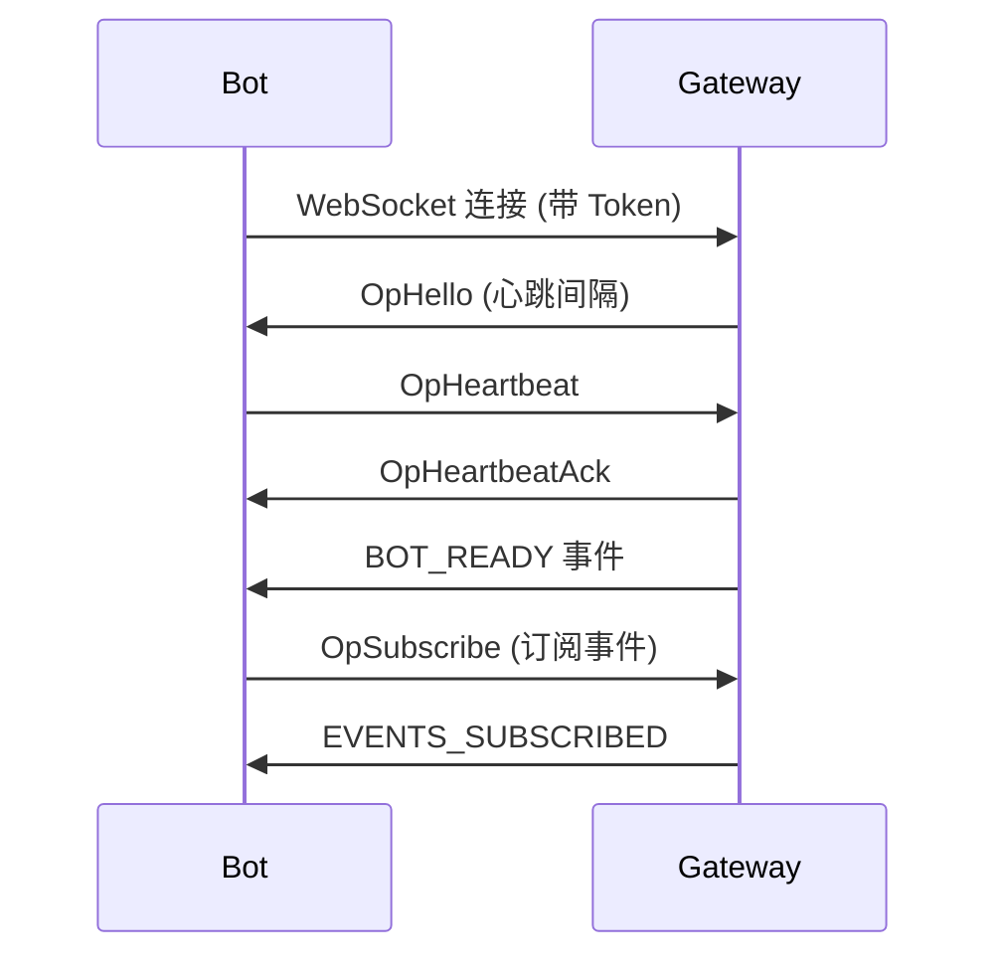
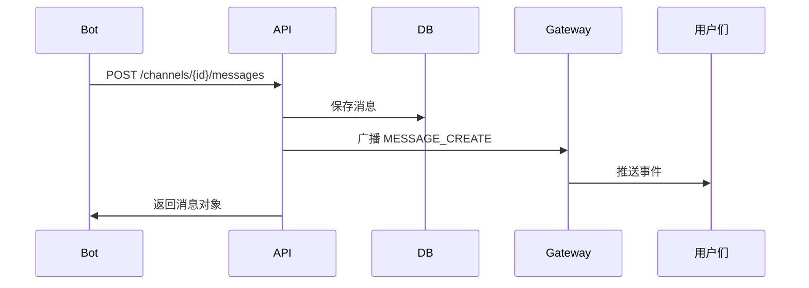

# 架构说明

本文档说明 Bubble 机器人的架构设计、工作原理和最佳实践。

## 整体架构

```
┌─────────────────┐
│   您的机器人     │
│  (Bot Client)   │
└────────┬────────┘
         │
         │ ① WebSocket Gateway（实时）
         │ ② Webhook（HTTP 回调）
         │ ③ HTTP API（主动请求）
         │
         ▼
┌─────────────────────┐
│  Bubble API Server  │
├─────────────────────┤
│  - 认证鉴权          │
│  - 事件分发          │
│  - 消息处理          │
│  - 权限管理          │
└──────────┬──────────┘
           │
           ▼
  ┌────────────────┐
  │  数据库 + Redis │
  └────────────────┘
```

## 机器人生命周期

### 1. 创建与配置

1. 开发者在平台创建机器人
2. 系统生成 Bot Token 和 Bot User
3. 机器人被邀请到服务器

### 2. 连接与认证


```mermaid
sequenceDiagram
    Bot->>Gateway: WebSocket 连接 (带 Token)
    Gateway->>Bot: OpHello (心跳间隔)
    Bot->>Gateway: OpHeartbeat
    Gateway->>Bot: OpHeartbeatAck
    Gateway->>Bot: BOT_READY 事件
    Bot->>Gateway: OpSubscribe (订阅事件)
    Gateway->>Bot: EVENTS_SUBSCRIBED
```

### 3. 事件接收

机器人连接后：

1. **自动订阅资源**：系统自动订阅机器人加入的所有服务器频道和私聊
2. **手动订阅事件**：机器人需要主动订阅感兴趣的事件类型
3. **接收事件**：只接收已订阅事件类型的消息

### 4. 消息发送


```mermaid
sequenceDiagram
    Bot->>API: POST /channels/{id}/messages
    API->>DB: 保存消息
    API->>Gateway: 广播 MESSAGE_CREATE
    Gateway->>用户们: 推送事件
    API->>Bot: 返回消息对象
```

## 核心组件

### Bot User

每个机器人都有一个关联的用户账号（Bot User）：

- 拥有独立的用户 ID
- 可以加入服务器和频道
- 可以发送和接收消息
- 特殊标识：`isBot: true`

### Token 认证

Bot Token 是 JWT 格式的访问凭证：

- 包含机器人 ID 和权限信息
- 用于所有 API 请求的认证
- 支持刷新和重置

### 事件订阅

两层订阅机制：

1. **资源订阅**（自动）：频道、私聊线程
2. **事件类型订阅**（手动）：MESSAGE_CREATE、GUILD_MEMBER_ADD 等

## 权限模型

### 服务器级权限

机器人继承 Bot User 在服务器中的权限：

- `VIEW_CHANNEL` - 查看频道
- `SEND_MESSAGES` - 发送消息
- `MANAGE_MESSAGES` - 管理消息

### API 权限

所有 Bot API 都需要有效的 Bot Token：

```http
Authorization: Bearer YOUR_BOT_TOKEN
```

权限检查流程：

1. 验证 Token 有效性
2. 获取 Bot User 信息
3. 检查操作权限
4. 执行请求

## 消息流转

### 频道消息

```
用户发送消息
    ↓
保存到数据库
    ↓
发布到 Redis (频道 Topic)
    ↓
Gateway 广播给所有订阅者
    ↓
机器人接收（如已订阅 MESSAGE_CREATE）
```

### 私聊消息

```
机器人发送 DM
    ↓
验证线程参与权限
    ↓
保存消息
    ↓
发布到 Redis (DM Topic + User Topics)
    ↓
推送给双方用户
```
